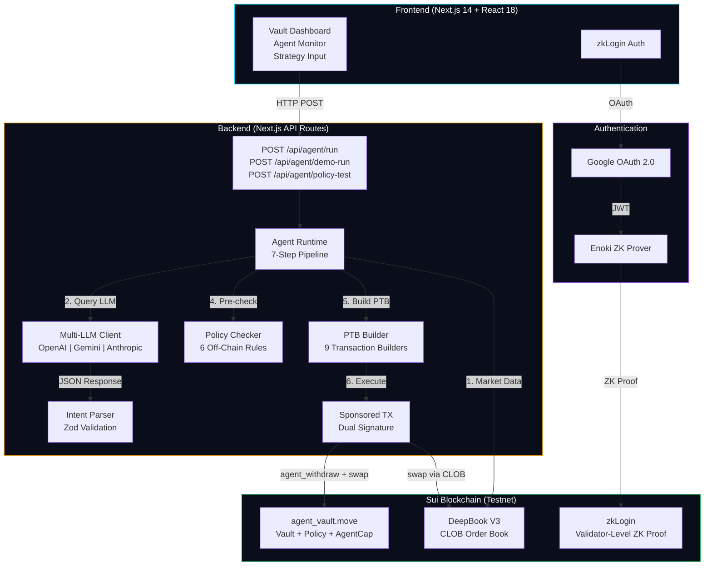

# Suistody

> **"Don't give your AI agent the keys. Give it a budget."**

Policy-Based AI Agent Custody on Sui -- HackMoney 2026 (ETHGlobal)

## What is Suistody?

Suistody is the first **policy-based AI agent custody** on Sui blockchain. Instead of giving your AI agent your private keys, you give it a **budget** with strict on-chain rules.

### The Problem

AI Agents increasingly need to transact autonomously -- calling APIs, purchasing cloud resources, executing DeFi trades. But current solutions either:
- Give agents full private key access (dangerous)
- Require human approval for every transaction (defeats autonomy)
- Only support token allowance caps with no multi-dimensional policy (EVM approve/transferFrom)

### The Solution

Suistody lets you create a **Vault** (shared on-chain object) with multi-dimensional policy enforcement:

| Policy Dimension     | Description                                          |
|----------------------|------------------------------------------------------|
| **Max Budget**       | Total cumulative spending cap (MIST)                 |
| **Max Per TX**       | Maximum amount per individual transaction            |
| **Allowed Actions**  | Whitelist of permitted operations (e.g., only swaps) |
| **Cooldown**         | Minimum time between consecutive transactions        |
| **Expiration**       | Auto-revoke after deadline (ms timestamp)            |

Your AI agent receives an **AgentCap** (transferable NFT permission token) that only works within these rules. Every withdrawal is validated against all five policy dimensions atomically on-chain. You can revoke the AgentCap instantly at any time.

---

## Quick Start (5 Minutes)

### Prerequisites

- Node.js >= 18
- Git

### 1. Clone & Install

```bash
git clone https://github.com/ARZER-TW/agent-vault.git
cd agent-vault
npm install
```

### 2. Configure Environment

```bash
cp .env.example .env.local
```

**Required** environment variables:

| Variable | Purpose |
|----------|---------|
| `NEXT_PUBLIC_GOOGLE_CLIENT_ID` | Google OAuth Client ID for zkLogin |
| `NEXT_PUBLIC_ENOKI_API_KEY` | Enoki API key for ZK proof generation |
| `SPONSOR_PRIVATE_KEY` | Sui keypair (bech32 `suiprivkey1...`) that pays gas |
| `AGENT_PRIVATE_KEY` | Sui keypair for the AI agent wallet |

**Optional** (set at least one for AI mode; Demo Mode works without any):

| Variable | Purpose |
|----------|---------|
| `OPENAI_API_KEY` | Use GPT-4o as the trading LLM |
| `GEMINI_API_KEY` | Use Gemini 2.0 Flash as the trading LLM |
| `ANTHROPIC_API_KEY` | Use Claude Sonnet as the trading LLM |
| `LLM_PROVIDER` | Force a specific provider (`openai` / `gemini` / `anthropic`) |

> **Tip:** The contract is already deployed to Sui Testnet. `NEXT_PUBLIC_PACKAGE_ID` is pre-configured in `.env.example`.

### 3. Run

```bash
npm run dev
```

Open [http://localhost:3000](http://localhost:3000).

### 4. Try Demo Mode (No LLM API Key Needed)

1. Sign in with Google (zkLogin)
2. Create a Vault with a test policy
3. On the Vault detail page, use **Demo Mode** to test policy enforcement directly
4. Run the **Guardrail Stress Test** to verify all 5 adversarial scenarios are blocked

---

## Key Features

### Multi-LLM Agent Runtime

The AI agent supports three LLM providers with automatic detection:

| Provider   | Model               | Env Variable       |
|------------|---------------------|-------------------|
| OpenAI     | gpt-4o              | `OPENAI_API_KEY`   |
| Google     | gemini-2.0-flash    | `GEMINI_API_KEY`   |
| Anthropic  | claude-sonnet-4-20250514     | `ANTHROPIC_API_KEY` |

Set any one API key and the system auto-detects the provider. Override with `LLM_PROVIDER` env var.

### Natural Language Strategy

Tell the AI how to trade in plain language. Four presets included:
- **Conservative DCA** -- Dollar-cost average with small fixed amounts
- **Take Profit** -- Only swap when price exceeds a threshold
- **Aggressive Trading** -- Use maximum per-tx amount for every swap
- **Minimal Risk** -- Hold unless spread is extremely tight

Or write your own custom strategy (up to 500 characters).

### Auto-Run Mode

Enable autonomous agent operation with configurable intervals (30s / 45s / 60s / 120s). The agent continuously:
1. Fetches DeepBook V3 order book data
2. Sends market snapshot to the configured LLM
3. Validates the LLM's decision against vault policy
4. Executes the trade via sponsored transaction
5. Logs results in a terminal-style activity panel

### Demo Mode

Skip the LLM entirely and test policy enforcement directly. Use preset buttons to:
- **Test Normal** -- Execute a withdrawal at 50% of per-tx limit (should succeed)
- **Test Over-Limit** -- Attempt 2x per-tx limit (should be blocked by policy)

### Guardrail Stress Test

Run 5 adversarial scenarios against your vault's policy to verify all guardrails:
1. **Budget Overflow** -- Exceed remaining budget
2. **Per-TX Breach** -- Exceed per-transaction limit
3. **Cooldown Bypass** -- Trade during cooldown period
4. **Unauthorized Agent** -- Use a non-authorized AgentCap
5. **Expired Policy** -- Trade after policy expiry

All 5 tests should show BLOCKED for a correctly configured vault.

### On-Chain Audit Trail

View all agent withdrawal transactions directly from on-chain events. Each entry shows timestamp, amount, action type, and links to SuiScan for full verification.

---

## Architecture

### System Overview



### Security Model: Dual-Layer Policy Enforcement

Policy is enforced **twice** -- off-chain (to save gas) and on-chain (to guarantee correctness):

```mermaid
flowchart LR
    subgraph OffChain["Off-Chain Pre-Check (policy-checker.ts)"]
        direction TB
        R0["Zero Amount?"]
        R1["Expired?"]
        R2["Cooldown Active?"]
        R3["Exceeds Per-TX Limit?"]
        R4["Exceeds Total Budget?"]
        R5["Action Whitelisted?"]
        R6["Sufficient Balance?"]

        R0 -->|"pass"| R1
        R1 -->|"pass"| R2
        R2 -->|"pass"| R3
        R3 -->|"pass"| R4
        R4 -->|"pass"| R5
        R5 -->|"pass"| R6
    end

    subgraph OnChain["On-Chain Enforcement (agent_vault.move)"]
        direction TB
        M0["assert amount > 0"]
        M1["assert cap.vault_id == vault"]
        M2["assert cap in authorized_caps"]
        M3["assert now < expires_at"]
        M4["assert cooldown elapsed"]
        M5["assert amount <= max_per_tx"]
        M6["assert amount <= budget - spent"]
        M7["assert action in allowed_actions"]
        M8["assert balance >= amount"]

        M0 --> M1 --> M2 --> M3 --> M4 --> M5 --> M6 --> M7 --> M8
    end

    Agent["Agent Request\n(amount, action)"] --> R0
    R6 -->|"Approved"| Build["Build PTB"]
    Build --> M0
    M8 -->|"All Passed"| Execute["Execute + Update State"]

    R0 -->|"fail"| Reject1["REJECTED\n(gas saved)"]
    R1 -->|"fail"| Reject1
    R2 -->|"fail"| Reject1
    R3 -->|"fail"| Reject1
    R4 -->|"fail"| Reject1
    R5 -->|"fail"| Reject1
    R6 -->|"fail"| Reject1

    M0 -->|"abort"| Reject2["ABORTED\n(on-chain)"]
    M1 -->|"abort"| Reject2
    M2 -->|"abort"| Reject2
    M3 -->|"abort"| Reject2
    M4 -->|"abort"| Reject2
    M5 -->|"abort"| Reject2
    M6 -->|"abort"| Reject2
    M7 -->|"abort"| Reject2
    M8 -->|"abort"| Reject2

    style OffChain fill:#1a1a2e,stroke:#f59e0b,color:#fff
    style OnChain fill:#1a1a2e,stroke:#22c55e,color:#fff
    style Reject1 fill:#dc2626,stroke:#dc2626,color:#fff
    style Reject2 fill:#dc2626,stroke:#dc2626,color:#fff
    style Execute fill:#22c55e,stroke:#22c55e,color:#fff
```



---

## Why Sui? (And Why This Can't Be Built on EVM)

Suistody is **not** a project that happens to be on Sui -- it is fundamentally enabled by five Sui-specific features that have no equivalent on EVM chains:

### 1. Object Capabilities (AgentCap as a First-Class Permission Object)

On Sui, capabilities are **objects with identity**. AgentCap is an owned object (`key, store`) that the contract verifies at the Move level:

```move
public struct AgentCap has key, store {
    id: UID,
    vault_id: ID,
}
```

On EVM, `approve(spender, amount)` only controls **how much**, not **what actions**, **how often**, or **when it expires**. Suistody enforces 5 policy dimensions (budget, per-tx limit, action whitelist, cooldown, expiry) in a single atomic check.

### 2. Programmable Transaction Blocks (PTB)

One Suistody transaction atomically composes:

```
agent_withdraw(vault, cap, amount) -> Coin<SUI>
  -> deepbook::swap(coin) -> [baseOut, quoteOut, deepOut]
  -> transferObjects([results], owner)
```

This is **one transaction, one signature, one gas fee**. On EVM, this would require 3 separate transactions with race conditions.

### 3. zkLogin (Google Login = Sui Address)

Users sign in with Google. No MetaMask. No seed phrase. No wallet extension. zkLogin is native to Sui's validator set -- zero extra gas cost for ZK verification.

### 4. Sponsored Transactions (Zero Gas for Users AND Agents)

Both the vault owner and the AI agent pay **zero gas**. A separate sponsor keypair covers gas for all operations -- native protocol support with no extra contracts needed.

### 5. Move Linear Type Safety

AgentCap **cannot be copied** -- this is enforced by the Move compiler, not by runtime checks. Move's type system eliminates entire classes of vulnerabilities at compile time.

### Summary Table

| Sui Feature          | How Suistody Uses It                                 | EVM Equivalent (And Why It Falls Short)      |
|----------------------|------------------------------------------------------|----------------------------------------------|
| Object Capabilities  | AgentCap = 5-dimensional policy-controlled permission | `approve()` = amount-only, no action/time control |
| PTB                  | withdraw + swap + transfer in one atomic TX          | 3 separate TXs with race conditions          |
| zkLogin              | Google login, native ZK proof on validators          | ERC-4337 adds ~200k gas per operation        |
| Sponsored TX         | Protocol-level gas sponsorship, 2 sigs, 0 contracts | Requires Relayer contract + off-chain infra  |
| Move Linear Types    | AgentCap can't be copied (compiler enforced)         | Solidity modifiers are runtime-only checks   |

---

## Tech Stack

| Layer       | Technology                              | Version / Package                  |
|-------------|-----------------------------------------|------------------------------------|
| Frontend    | Next.js (App Router) + TypeScript       | next@14.2.35, react@18             |
| Styling     | Tailwind CSS + Vault Noir design system | tailwindcss@3.4.1                  |
| State       | Zustand + React Query                   | zustand@5, @tanstack/react-query@5 |
| Sui SDK     | @mysten/sui, @mysten/zklogin            | @mysten/sui@1.38.0                 |
| DeepBook    | @mysten/deepbook-v3                     | v0.17.0                            |
| AI          | OpenAI / Gemini / Anthropic (auto-detect) | gpt-4o, gemini-2.0-flash, claude-sonnet-4-20250514 |
| Contracts   | Sui Move                                | edition 2024.beta, Sui Testnet     |
| Validation  | Zod                                     | zod@3.24.0                         |
| Testing     | Vitest + sui move test                  | vitest@3.0.0                       |

---

## Project Structure

```
suistody/
+-- contracts/                       # Sui Move smart contracts
|   +-- sources/
|   |   +-- agent_vault.move         # Vault, Policy, AgentCap, OwnerCap
|   |   +-- agent_vault_tests.move   # 15 on-chain tests (all passing)
|   +-- Move.toml
+-- app/                             # Next.js 14 App Router
|   +-- page.tsx                     # Landing page (Vault Noir hero)
|   +-- layout.tsx                   # Root layout with Providers
|   +-- globals.css                  # Vault Noir design system
|   +-- auth/callback/page.tsx       # zkLogin OAuth callback handler
|   +-- vault/
|   |   +-- page.tsx                 # Vault dashboard (list all vaults)
|   |   +-- create/page.tsx          # Create vault form page
|   |   +-- [id]/page.tsx            # Vault detail + agent runtime
|   +-- api/
|       +-- agent/
|       |   +-- run/route.ts         # POST: execute one agent cycle
|       |   +-- demo-run/route.ts    # POST: demo mode (skip LLM)
|       |   +-- policy-test/route.ts # POST: guardrail stress test
|       |   +-- address/route.ts     # GET: agent wallet address
|       +-- vault/[id]/route.ts      # GET: fetch vault data
|       +-- sponsor/
|           +-- address/route.ts     # GET: sponsor wallet address
|           +-- sign-and-execute/route.ts # POST: co-sign sponsored TX
+-- lib/
|   +-- constants.ts                 # Package ID, network, action types
|   +-- sui/                         # Sui SDK
|   +-- agent/                       # AI Agent runtime + policy
|   +-- vault/                       # Vault types, PTB builders, service
|   +-- auth/                        # zkLogin + sponsored TX
|   +-- store/                       # Zustand state
+-- components/                      # React components
|   +-- layout/header.tsx
|   +-- auth/login-button.tsx
|   +-- vault/                       # Vault UI components
|   +-- agent/                       # Agent activity log
|   +-- ui/                          # Shared UI (toast, ring-chart)
+-- vitest.config.ts
+-- tailwind.config.ts
+-- tsconfig.json
+-- package.json
```

---

## Development

### Run Tests

```bash
# TypeScript unit tests (20 tests)
npm test

# Move contract tests (15 tests)
cd contracts && sui move test
```

---

## Status

| Component               | Status             | Details                                          |
|-------------------------|--------------------|--------------------------------------------------|
| Move Contracts          | Deployed (Testnet) | 15/15 tests passing                              |
| DeepBook V3 Integration | Complete           | Order book + swap + quotes + pool info           |
| Multi-LLM Runtime       | Complete           | OpenAI / Gemini / Anthropic with auto-detect     |
| Agent Runtime           | Complete           | 7-step pipeline with confidence threshold        |
| Policy Checker          | Complete           | 6 off-chain validation rules                     |
| zkLogin                 | Complete           | Google OAuth + Enoki ZK prover                   |
| Sponsored TX            | Complete           | Dual-signature with direct fallback              |
| Natural Language Strategy | Complete         | 4 presets + custom strategy (up to 500 chars)    |
| Auto-Run Mode           | Complete           | Configurable interval with countdown             |
| Guardrail Stress Test   | Complete           | 5 adversarial scenarios                          |
| On-Chain Audit Trail    | Complete           | Event-based transaction history                  |
| Demo Mode               | Complete           | Forced-amount policy testing (skip LLM)          |
| Frontend                | Complete           | Vault Noir design, all pages                     |
| Unit Tests              | 20/20 passing      | Vitest (intent-parser + policy-checker)          |
| Contract Tests          | 15/15 passing      | sui move test                                    |

---

## License

MIT
