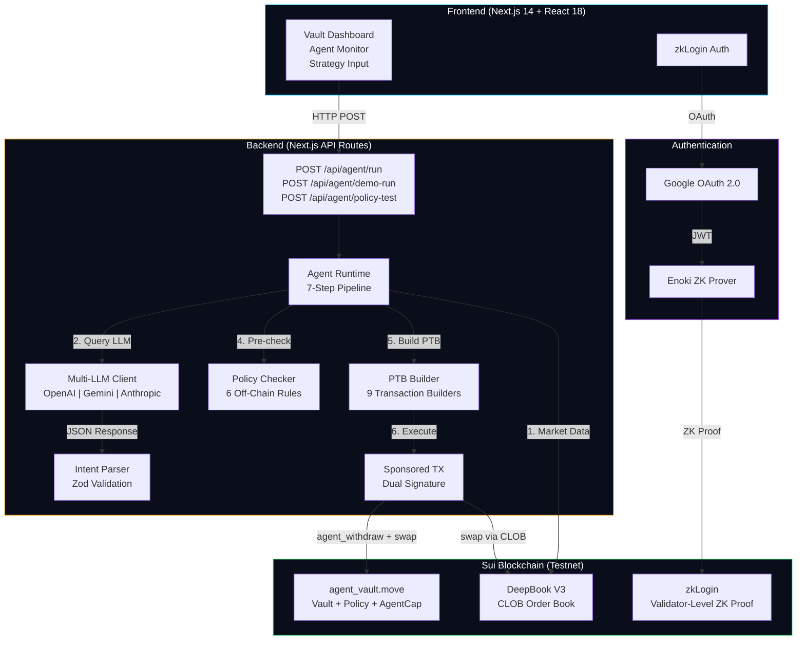
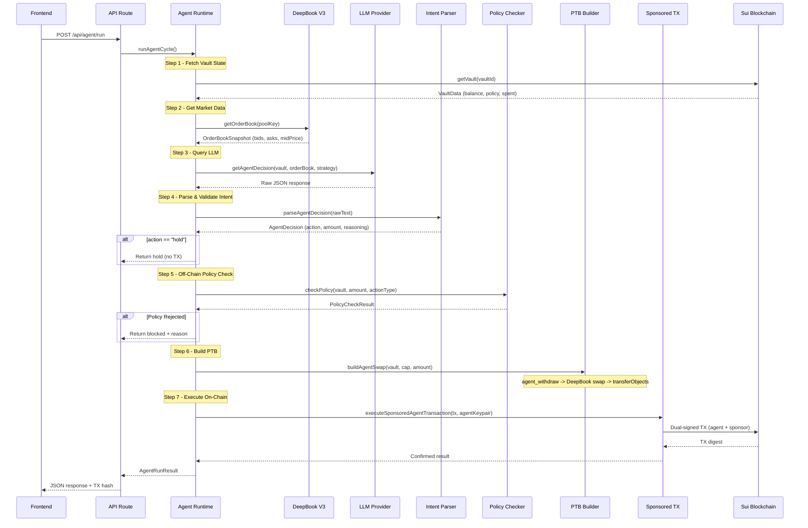

# AgentVault

> **"Don't give your AI agent the keys. Give it a budget."**

Policy-Based AI Agent Wallet on Sui -- HackMoney 2026 (ETHGlobal)

## What is AgentVault?

AgentVault is the first **policy-based AI agent wallet** on Sui blockchain. Instead of giving your AI agent your private keys, you give it a **budget** with strict on-chain rules.

### The Problem

AI Agents increasingly need to transact autonomously -- calling APIs, purchasing cloud resources, executing DeFi trades. But current solutions either:
- Give agents full private key access (dangerous)
- Require human approval for every transaction (defeats autonomy)
- Only support token allowance caps with no multi-dimensional policy (EVM approve/transferFrom)

### The Solution

AgentVault lets you create a **Vault** (shared on-chain object) with multi-dimensional policy enforcement:

| Policy Dimension     | Description                                          |
|----------------------|------------------------------------------------------|
| **Max Budget**       | Total cumulative spending cap (MIST)                 |
| **Max Per TX**       | Maximum amount per individual transaction            |
| **Allowed Actions**  | Whitelist of permitted operations (e.g., only swaps) |
| **Cooldown**         | Minimum time between consecutive transactions        |
| **Expiration**       | Auto-revoke after deadline (ms timestamp)            |

Your AI agent receives an **AgentCap** (transferable NFT permission token) that only works within these rules. Every withdrawal is validated against all five policy dimensions atomically on-chain. You can revoke the AgentCap instantly at any time.

---

## Quick Start (5 Minutes)

### Prerequisites

- Node.js >= 18
- Git

### 1. Clone & Install

```bash
git clone https://github.com/ARZER-TW/agent-vault.git
cd agent-vault
npm install
```

### 2. Configure Environment

```bash
cp .env.example .env.local
```

**Required** environment variables:

| Variable | Purpose |
|----------|---------|
| `NEXT_PUBLIC_GOOGLE_CLIENT_ID` | Google OAuth Client ID for zkLogin |
| `NEXT_PUBLIC_ENOKI_API_KEY` | Enoki API key for ZK proof generation |
| `SPONSOR_PRIVATE_KEY` | Sui keypair (bech32 `suiprivkey1...`) that pays gas |
| `AGENT_PRIVATE_KEY` | Sui keypair for the AI agent wallet |

**Optional** (set at least one for AI mode; Demo Mode works without any):

| Variable | Purpose |
|----------|---------|
| `OPENAI_API_KEY` | Use GPT-4o as the trading LLM |
| `GEMINI_API_KEY` | Use Gemini 2.0 Flash as the trading LLM |
| `ANTHROPIC_API_KEY` | Use Claude Sonnet as the trading LLM |
| `LLM_PROVIDER` | Force a specific provider (`openai` / `gemini` / `anthropic`) |

> **Tip:** The contract is already deployed to Sui Testnet. `NEXT_PUBLIC_PACKAGE_ID` is pre-configured in `.env.example`.

### 3. Run

```bash
npm run dev
```

Open [http://localhost:3000](http://localhost:3000).

### 4. Try Demo Mode (No LLM API Key Needed)

1. Sign in with Google (zkLogin)
2. Create a Vault with a test policy
3. On the Vault detail page, use **Demo Mode** to test policy enforcement directly
4. Run the **Guardrail Stress Test** to verify all 5 adversarial scenarios are blocked

---

## Key Features

### Multi-LLM Agent Runtime

The AI agent supports three LLM providers with automatic detection:

| Provider   | Model               | Env Variable       |
|------------|---------------------|-------------------|
| OpenAI     | gpt-4o              | `OPENAI_API_KEY`   |
| Google     | gemini-2.0-flash    | `GEMINI_API_KEY`   |
| Anthropic  | claude-sonnet-4-20250514     | `ANTHROPIC_API_KEY` |

Set any one API key and the system auto-detects the provider. Override with `LLM_PROVIDER` env var.

### Natural Language Strategy

Tell the AI how to trade in plain language. Four presets included:
- **Conservative DCA** -- Dollar-cost average with small fixed amounts
- **Take Profit** -- Only swap when price exceeds a threshold
- **Aggressive Trading** -- Use maximum per-tx amount for every swap
- **Minimal Risk** -- Hold unless spread is extremely tight

Or write your own custom strategy (up to 500 characters).

### Auto-Run Mode

Enable autonomous agent operation with configurable intervals (30s / 45s / 60s / 120s). The agent continuously:
1. Fetches DeepBook V3 order book data
2. Sends market snapshot to the configured LLM
3. Validates the LLM's decision against vault policy
4. Executes the trade via sponsored transaction
5. Logs results in a terminal-style activity panel

### Demo Mode

Skip the LLM entirely and test policy enforcement directly. Use preset buttons to:
- **Test Normal** -- Execute a withdrawal at 50% of per-tx limit (should succeed)
- **Test Over-Limit** -- Attempt 2x per-tx limit (should be blocked by policy)

### Guardrail Stress Test

Run 5 adversarial scenarios against your vault's policy to verify all guardrails:
1. **Budget Overflow** -- Exceed remaining budget
2. **Per-TX Breach** -- Exceed per-transaction limit
3. **Cooldown Bypass** -- Trade during cooldown period
4. **Unauthorized Agent** -- Use a non-authorized AgentCap
5. **Expired Policy** -- Trade after policy expiry

All 5 tests should show BLOCKED for a correctly configured vault.

---

## Architecture

### System Overview



### Agent Decision Loop (7-Step Pipeline)

Based on the actual implementation in `lib/agent/runtime.ts`:



### Security Model: Dual-Layer Policy Enforcement

Policy is enforced **twice** -- off-chain (to save gas) and on-chain (to guarantee correctness):

```mermaid
flowchart LR
    subgraph OffChain["Off-Chain Pre-Check (policy-checker.ts)"]
        direction TB
        R0["Zero Amount?"]
        R1["Expired?"]
        R2["Cooldown Active?"]
        R3["Exceeds Per-TX Limit?"]
        R4["Exceeds Total Budget?"]
        R5["Action Whitelisted?"]
        R6["Sufficient Balance?"]

        R0 -->|"pass"| R1
        R1 -->|"pass"| R2
        R2 -->|"pass"| R3
        R3 -->|"pass"| R4
        R4 -->|"pass"| R5
        R5 -->|"pass"| R6
    end

    subgraph OnChain["On-Chain Enforcement (agent_vault.move)"]
        direction TB
        M0["assert amount > 0"]
        M1["assert cap.vault_id == vault"]
        M2["assert cap in authorized_caps"]
        M3["assert now < expires_at"]
        M4["assert cooldown elapsed"]
        M5["assert amount <= max_per_tx"]
        M6["assert amount <= budget - spent"]
        M7["assert action in allowed_actions"]
        M8["assert balance >= amount"]

        M0 --> M1 --> M2 --> M3 --> M4 --> M5 --> M6 --> M7 --> M8
    end

    Agent["Agent Request\n(amount, action)"] --> R0
    R6 -->|"Approved"| Build["Build PTB"]
    Build --> M0
    M8 -->|"All Passed"| Execute["Execute + Update State"]

    R0 -->|"fail"| Reject1["REJECTED\n(gas saved)"]
    R1 -->|"fail"| Reject1
    R2 -->|"fail"| Reject1
    R3 -->|"fail"| Reject1
    R4 -->|"fail"| Reject1
    R5 -->|"fail"| Reject1
    R6 -->|"fail"| Reject1

    M0 -->|"abort"| Reject2["ABORTED\n(on-chain)"]
    M1 -->|"abort"| Reject2
    M2 -->|"abort"| Reject2
    M3 -->|"abort"| Reject2
    M4 -->|"abort"| Reject2
    M5 -->|"abort"| Reject2
    M6 -->|"abort"| Reject2
    M7 -->|"abort"| Reject2
    M8 -->|"abort"| Reject2

    style OffChain fill:#1a1a2e,stroke:#f59e0b,color:#fff
    style OnChain fill:#1a1a2e,stroke:#22c55e,color:#fff
    style Reject1 fill:#dc2626,stroke:#dc2626,color:#fff
    style Reject2 fill:#dc2626,stroke:#dc2626,color:#fff
    style Execute fill:#22c55e,stroke:#22c55e,color:#fff
```



### Data Flow

1. **Owner** logs in via zkLogin (Google OAuth) -- no wallet extension needed
2. **Owner** creates a Vault, deposits SUI, sets Policy, mints AgentCap
3. **Agent** fetches market data from DeepBook V3 order book
4. **Agent** sends market snapshot to configured LLM for analysis
5. **LLM** returns structured `AgentDecision` (action + reasoning + confidence)
6. **Policy Checker** validates the intent off-chain (pre-flight, saves gas)
7. **PTB Builder** composes atomic transaction: `agent_withdraw -> DeepBook swap`
8. **Sponsored TX** executes on-chain -- user and agent pay zero gas
9. **UI** displays TX hash with Sui Explorer link for on-chain verification

**Demo Mode**: Skip steps 3-5, inject forced amount to demonstrate policy enforcement directly (over-limit blocked, normal amount passes).

---

## Tech Stack

| Layer       | Technology                              | Version / Package                  |
|-------------|-----------------------------------------|------------------------------------|
| Frontend    | Next.js (App Router) + TypeScript       | next@14.2.35, react@18             |
| Styling     | Tailwind CSS + Vault Noir design system | tailwindcss@3.4.1                  |
| State       | Zustand + React Query                   | zustand@5, @tanstack/react-query@5 |
| Sui SDK     | @mysten/sui, @mysten/zklogin            | @mysten/sui@1.38.0                 |
| DeepBook    | @mysten/deepbook-v3                     | v0.17.0                            |
| AI          | OpenAI / Gemini / Anthropic (auto-detect) | gpt-4o, gemini-2.0-flash, claude-sonnet-4-20250514 |
| Contracts   | Sui Move                                | edition 2024.beta, Sui Testnet     |
| Validation  | Zod                                     | zod@3.24.0                         |
| Testing     | Vitest + sui move test                  | vitest@3.0.0                       |

## Why Sui? (And Why This Can't Be Built on EVM)

AgentVault is **not** a project that happens to be on Sui -- it is fundamentally enabled by five Sui-specific features that have no equivalent on EVM chains:

### 1. Object Capabilities (AgentCap as a First-Class Permission Object)

On Sui, capabilities are **objects with identity**. AgentCap is an owned object (`key, store`) that the contract verifies at the Move level:

```move
// Move: AgentCap is a real object -- can be transferred, revoked, checked at compile time
public struct AgentCap has key, store {
    id: UID,
    vault_id: ID,
}
```

On EVM, `approve(spender, amount)` only controls **how much**, not **what actions**, **how often**, or **when it expires**. AgentVault enforces 5 policy dimensions (budget, per-tx limit, action whitelist, cooldown, expiry) in a single atomic check. ERC-20 approve cannot express this.

### 2. Programmable Transaction Blocks (PTB)

One AgentVault transaction atomically composes:

```
agent_withdraw(vault, cap, amount) -> Coin<SUI>
  -> deepbook::swap(coin) -> [baseOut, quoteOut, deepOut]
  -> transferObjects([results], owner)
```

This is **one transaction, one signature, one gas fee**. On EVM, this would require:
- TX 1: `approve()` the DEX contract
- TX 2: `swap()` on the DEX
- TX 3: Transfer results back

Three transactions = three gas fees, three failure points, and a race condition window between TX 1 and TX 2 where funds are exposed.

### 3. zkLogin (Google Login = Sui Address)

AgentVault users sign in with Google. No MetaMask. No seed phrase. No wallet extension.

```
Google OAuth JWT -> ZK Proof (Enoki) -> Sui Address -> Sign Transactions
```

zkLogin is native to Sui's validator set -- the proof is verified on-chain by validators, not by a smart contract. This means zero extra gas cost for ZK verification, unlike EVM's ERC-4337 account abstraction which adds ~200k gas overhead per UserOp.

### 4. Sponsored Transactions (Zero Gas for Users AND Agents)

Both the vault owner and the AI agent pay **zero gas**. A separate sponsor keypair covers gas for all operations:

```typescript
transaction.setSender(agentAddress);      // Agent signs the action
transaction.setGasOwner(sponsorAddress);  // Sponsor pays gas
// Two signatures, one transaction -- native protocol support
```

On EVM, meta-transactions require a Relayer contract, EIP-712 signatures, and a trusted off-chain relayer service. Sui's sponsored TX is a protocol-level primitive with no extra contracts needed.

### 5. Move Linear Type Safety

AgentCap **cannot be copied** -- this is enforced by the Move compiler, not by runtime checks:

```move
// Move compiler REJECTS this: AgentCap has no `copy` ability
let cap2 = cap; // ERROR: cannot copy AgentCap
```

In Solidity, access control relies on `require(msg.sender == owner)` -- a runtime check that can be bypassed by delegate calls, proxy upgrades, or reentrancy. Move's type system eliminates entire classes of vulnerabilities at compile time.

### Summary Table

| Sui Feature          | How AgentVault Uses It                               | EVM Equivalent (And Why It Falls Short)      |
|----------------------|------------------------------------------------------|----------------------------------------------|
| Object Capabilities  | AgentCap = 5-dimensional policy-controlled permission | `approve()` = amount-only, no action/time control |
| PTB                  | withdraw + swap + transfer in one atomic TX          | 3 separate TXs with race conditions          |
| zkLogin              | Google login, native ZK proof on validators          | ERC-4337 adds ~200k gas per operation        |
| Sponsored TX         | Protocol-level gas sponsorship, 2 sigs, 0 contracts | Requires Relayer contract + off-chain infra  |
| Move Linear Types    | AgentCap can't be copied (compiler enforced)         | Solidity modifiers are runtime-only checks   |

---

## Project Structure

```
agent-vault/
+-- contracts/                       # Sui Move smart contracts
|   +-- sources/
|   |   +-- agent_vault.move         # Vault, Policy, AgentCap, OwnerCap (263 lines)
|   |   +-- agent_vault_tests.move   # 15 on-chain tests (all passing)
|   +-- Move.toml
+-- app/                             # Next.js 14 App Router
|   +-- page.tsx                     # Landing page (Vault Noir hero)
|   +-- layout.tsx                   # Root layout with Providers
|   +-- globals.css                  # Vault Noir design system
|   +-- auth/callback/page.tsx       # zkLogin OAuth callback handler
|   +-- vault/
|   |   +-- page.tsx                 # Vault dashboard (list all vaults)
|   |   +-- create/page.tsx          # Create vault form page
|   |   +-- [id]/page.tsx            # Vault detail + agent runtime
|   +-- api/
|       +-- agent/
|       |   +-- run/route.ts         # POST: execute one agent cycle (market -> LLM -> policy -> TX)
|       |   +-- demo-run/route.ts    # POST: demo mode (skip LLM, forced amount)
|       |   +-- policy-test/route.ts # POST: guardrail stress test (5 adversarial scenarios)
|       |   +-- address/route.ts     # GET: agent wallet address
|       +-- vault/[id]/route.ts      # GET: fetch vault data
|       +-- sponsor/
|           +-- address/route.ts     # GET: sponsor wallet address
|           +-- sign-and-execute/route.ts # POST: co-sign sponsored TX
+-- lib/
|   +-- constants.ts                 # Package ID, network, action types, unit conversion
|   +-- sui/
|   |   +-- client.ts               # SuiClient singleton
|   |   +-- deepbook.ts             # DeepBookClient singleton
|   |   +-- market.ts               # Order book snapshots, swap quotes, pool info
|   |   +-- coins.ts                # Fetch SUI coin objects by owner
|   +-- agent/
|   |   +-- runtime.ts              # Agent cycle orchestrator (7-step pipeline)
|   |   +-- claude-client.ts        # Multi-LLM wrapper (OpenAI/Gemini/Anthropic) with system prompt
|   |   +-- intent-parser.ts        # Zod-validated AgentDecision parsing
|   |   +-- policy-checker.ts       # Off-chain policy pre-validation (6 rules)
|   |   +-- __tests__/
|   |       +-- intent-parser.test.ts   # 9 tests
|   |       +-- policy-checker.test.ts  # 11 tests
|   +-- vault/
|   |   +-- types.ts                # VaultData, Policy, AgentCapData, SwapParams, AgentLogEntry
|   |   +-- ptb-builder.ts          # 9 PTB builders (create, deposit, depositFromGas, withdraw, updatePolicy, createAgentCap, revokeAgentCap, agentWithdraw, agentSwap)
|   |   +-- service.ts              # On-chain vault queries (getVault, getOwnerCaps, getAgentCaps, getOwnedVaults, isAgentCapAuthorized, getRemainingBudget)
|   +-- auth/
|   |   +-- zklogin.ts              # Full zkLogin flow (begin, complete, sign) via Enoki API
|   |   +-- sponsored-tx.ts         # Sponsored TX + agent TX + direct zkLogin TX execution
|   +-- store/
|       +-- auth-store.ts           # Zustand auth state (address, keypair, zkProof)
|       +-- vault-store.ts          # Zustand vault state (vaults, caps, agent logs)
+-- components/
|   +-- providers.tsx               # React Query provider
|   +-- layout/header.tsx           # Sticky header with nav + login
|   +-- auth/login-button.tsx       # Google zkLogin button
|   +-- ui/toast.tsx                # Toast notification system
|   +-- vault/
|   |   +-- vault-card.tsx          # Vault summary card with budget bar
|   |   +-- create-vault-form.tsx   # Full vault creation form
|   |   +-- owner-actions.tsx       # Deposit, withdraw, policy update, agent cap management
|   |   +-- policy-row.tsx          # Policy parameter display row
|   |   +-- stat-card.tsx           # Vault stat card component
|   |   +-- demo-mode-panel.tsx     # Demo mode: forced amount + policy test
|   |   +-- strategy-input.tsx      # Natural language strategy input with presets
|   |   +-- auto-run-controls.tsx   # Auto-run mode with interval selector + countdown
|   |   +-- guardrail-stress-test.tsx # 5 adversarial policy tests
|   +-- agent/
|       +-- agent-activity-log.tsx  # Terminal-style agent log viewer
+-- scripts/
|   +-- test-deepbook.ts            # DeepBook V3 testnet diagnostic script
+-- vitest.config.ts
+-- tailwind.config.ts
+-- tsconfig.json
+-- package.json
```

---

## Development

### Environment Variables (Full Reference)

```bash
# Sui Network
NEXT_PUBLIC_SUI_NETWORK=testnet

# Move Contract (already deployed)
NEXT_PUBLIC_PACKAGE_ID=0xbf74c7a7717e74f5074d024e27a5f6d2838d5025e4c67afd758286e3ba6bb31b

# zkLogin - Google OAuth
NEXT_PUBLIC_GOOGLE_CLIENT_ID=your-client-id.apps.googleusercontent.com
GOOGLE_CLIENT_SECRET=your-client-secret
NEXT_PUBLIC_REDIRECT_URI=http://localhost:3000/auth/callback

# Enoki API (for zkLogin ZK proof)
NEXT_PUBLIC_ENOKI_API_KEY=your-enoki-api-key

# LLM API (set ONE -- auto-detects provider)
OPENAI_API_KEY=sk-xxx          # or
GEMINI_API_KEY=xxx             # or
ANTHROPIC_API_KEY=sk-ant-xxx

# Optional: force specific provider
# LLM_PROVIDER=openai

# Sponsor Wallet (pays gas for users)
SPONSOR_PRIVATE_KEY=suiprivkey1xxx

# Agent Wallet (executes trades)
AGENT_PRIVATE_KEY=suiprivkey1xxx
```

### Run Tests

```bash
# TypeScript unit tests (20 tests)
npm test

# Move contract tests (15 tests)
cd contracts && sui move test
```

### Diagnose DeepBook

```bash
npx tsx scripts/test-deepbook.ts
```

---

## Move Contract

The core contract is deployed to Sui Testnet at:

```
0xbf74c7a7717e74f5074d024e27a5f6d2838d5025e4c67afd758286e3ba6bb31b
```

### Core Structs

| Struct     | Abilities       | Purpose                                        |
|------------|-----------------|------------------------------------------------|
| `Vault`    | `key`           | Shared object holding SUI balance + policy     |
| `Policy`   | `store, copy, drop` | Multi-dimensional agent operation limits   |
| `AgentCap` | `key, store`    | Transferable permission NFT for agents         |
| `OwnerCap` | `key, store`    | Proof of vault ownership                       |

### Entry Functions

| Function           | Caller | Description                           |
|--------------------|--------|---------------------------------------|
| `create_vault`     | Owner  | Create Vault + set Policy + deposit   |
| `deposit`          | Owner  | Add SUI to Vault                      |
| `withdraw_all`     | Owner  | Withdraw all funds                    |
| `update_policy`    | Owner  | Modify all policy parameters          |
| `create_agent_cap` | Owner  | Mint AgentCap for an agent address    |
| `revoke_agent_cap` | Owner  | Remove AgentCap from authorized list  |
| `agent_withdraw`   | Agent  | Policy-checked withdrawal (10 checks) |

### Error Codes

| Code | Constant               | Trigger                            |
|------|------------------------|------------------------------------|
| 0    | `E_NOT_OWNER`          | OwnerCap vault_id mismatch         |
| 1    | `E_BUDGET_EXCEEDED`    | total_spent + amount > max_budget  |
| 2    | `E_NOT_WHITELISTED`    | Action type not in allowed list    |
| 3    | `E_EXPIRED`            | Current time >= expires_at         |
| 4    | `E_COOLDOWN`           | Time since last tx < cooldown_ms   |
| 5    | `E_INVALID_CAP`        | AgentCap not authorized or wrong vault |
| 6    | `E_INSUFFICIENT_BALANCE` | Vault balance < requested amount |
| 7    | `E_PER_TX_EXCEEDED`    | amount > max_per_tx                |
| 8    | `E_ZERO_AMOUNT`        | amount == 0                        |

### Test Coverage (15/15 passing)

- `test_create_vault` -- Vault creation with initial deposit and policy
- `test_deposit` -- Owner deposits additional funds
- `test_withdraw_all` -- Owner withdraws all funds
- `test_create_agent_cap` -- Minting AgentCap to agent address
- `test_agent_withdraw_success` -- Happy-path agent withdrawal
- `test_agent_withdraw_budget_exceeded` -- Total budget enforcement (6 withdrawals)
- `test_agent_withdraw_per_tx_exceeded` -- Per-transaction limit enforcement
- `test_agent_withdraw_expired` -- Expiry enforcement
- `test_agent_withdraw_cooldown` -- Cooldown enforcement
- `test_agent_withdraw_not_whitelisted` -- Action whitelist enforcement
- `test_agent_withdraw_revoked_cap` -- Revoked cap rejection
- `test_revoke_agent_cap` -- Cap revocation flow
- `test_update_policy` -- Policy update with new parameters
- `test_agent_withdraw_zero_amount` -- Zero amount rejection
- `test_agent_withdraw_multiple_with_cooldown` -- Multi-withdrawal with cooldown respect

---

## Frontend Design

The frontend uses the **Vault Noir** design system:

| Property        | Value                                                    |
|-----------------|----------------------------------------------------------|
| Fonts           | Syne (display), DM Sans (body), JetBrains Mono (code)   |
| Background      | `#060a13` (void) with noise texture overlay              |
| Accent          | `#00d4ff` (cyan) with glow effects                       |
| Secondary       | `#f59e0b` (amber) for warnings/budgets                   |
| Cards           | Glass-morphism (blur + gradient + border)                |
| Animations      | fadeInUp, pulse-glow, ring-rotate, shimmer               |
| Components      | glass-card, btn-primary, btn-ghost, budget-bar, terminal-log |

### Pages

| Route              | Component             | Description                           |
|--------------------|-----------------------|---------------------------------------|
| `/`                | Landing page          | Hero with tagline + how-it-works + tech stack |
| `/vault`           | Vault dashboard       | List all user vaults with VaultCard   |
| `/vault/create`    | Create vault form     | Coin selector + policy configuration  |
| `/vault/[id]`      | Vault detail          | Stats, budget bar, policy, agent runtime, demo mode, strategy, auto-run, guardrail stress test |
| `/auth/callback`   | zkLogin callback      | Process OAuth token + ZK proof        |

### API Routes

| Route                           | Method | Description                                                     |
|---------------------------------|--------|-----------------------------------------------------------------|
| `/api/agent/run`                | POST   | Execute one agent cycle (market -> LLM -> policy -> TX)         |
| `/api/agent/demo-run`           | POST   | Demo mode: skip LLM, test policy with forced amount             |
| `/api/agent/policy-test`        | POST   | Guardrail stress test with 5 adversarial scenarios              |
| `/api/agent/address`            | GET    | Return agent wallet Sui address                                 |
| `/api/vault/[id]`              | GET    | Fetch vault data from chain                                     |
| `/api/sponsor/address`          | GET    | Return sponsor wallet Sui address                               |
| `/api/sponsor/sign-and-execute` | POST   | Co-sign and execute sponsored transaction                       |

---

## Documentation

- [TECH_SPEC.md](./TECH_SPEC.md) -- Full technical specification and design
- [IMPLEMENTATION_PLAN.md](./IMPLEMENTATION_PLAN.md) -- 5-day development schedule
- [docs/CONTRIB.md](./docs/CONTRIB.md) -- Development workflow, scripts, environment setup, testing
- [docs/RUNBOOK.md](./docs/RUNBOOK.md) -- Deployment, operations, troubleshooting

---

## Status

| Component               | Status             | Details                                          |
|-------------------------|--------------------|--------------------------------------------------|
| Move Contracts          | Deployed (Testnet) | 15/15 tests passing                              |
| PTB Builder             | Complete           | 9 transaction builders                           |
| DeepBook V3 Integration | Complete           | Order book + swap + quotes + pool info + fallback |
| Multi-LLM Runtime       | Complete           | OpenAI gpt-4o / Gemini 2.0 Flash / Anthropic Claude with auto-detect |
| Agent Runtime           | Complete           | 7-step pipeline (market -> LLM -> policy -> TX execution) |
| Policy Checker          | Complete           | 6 off-chain validation rules                     |
| Intent Parser           | Complete           | Zod-validated + code block extraction            |
| zkLogin                 | Complete           | Google OAuth + Enoki ZK prover                   |
| Sponsored TX            | Complete           | Dual-signature: agent signs action, sponsor pays gas |
| On-chain TX Execution   | Complete           | Sponsored TX with direct fallback                |
| Demo Mode               | Complete           | Forced-amount policy testing (skip LLM)          |
| Natural Language Strategy | Complete         | 4 presets + custom strategy (up to 500 chars)    |
| Auto-Run Mode           | Complete           | Configurable interval (30s/45s/60s/120s) with countdown |
| Guardrail Stress Test   | Complete           | 5 adversarial scenarios (budget, per-tx, cooldown, unauthorized, expired) |
| Frontend                | Complete           | Vault Noir design, all pages                     |
| Unit Tests              | 20/20 passing      | Vitest (intent-parser + policy-checker)          |
| Contract Tests          | 15/15 passing      | sui move test                                    |

---

## License

MIT
